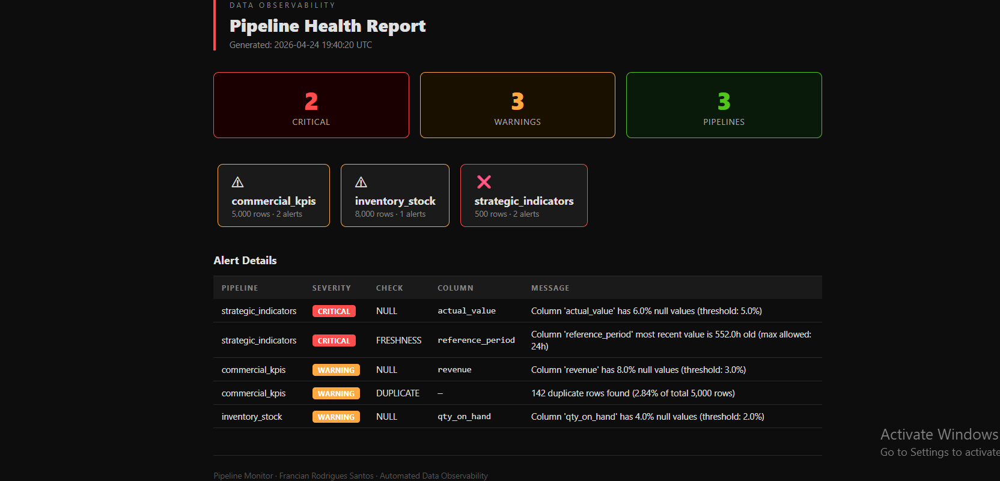

# 🔍 Pipeline Health Monitor — Data Observability Engine

> Monitoramento automatizado de pipelines de dados com detecção de drift estatístico, alertas de nulos inesperados, duplicatas e validação de frescor dos dados — eliminando validação manual e entregando dados confiáveis ao executivo sem intervenção humana.

---

## 📌 Contexto e Motivação

Na **Very Tecnologia** e na **JSB Distribuidora**, dois problemas recorrentes impactavam a qualidade das decisões:

1. **Falhas silenciosas em pipelines** — erros upstream truncando datasets passavam despercebidos por horas, fazendo executivos agirem com dados incompletos ou desatualizados.
2. **Ciclos manuais de QA** — analistas gastavam 30–40% do tempo validando dados antes de publicar dashboards, atrasando o ciclo decisório em até 40%.

Este projeto operacionaliza a camada de observabilidade que estruturei internamente. Em contextos de produção, contribuiu para **+30% de melhoria na confiabilidade dos dados** e viabilizou **pipelines end-to-end totalmente automatizados** sem intervenção manual.

---

## 🏗️ Arquitetura

```
┌─────────────────────────────────────────────────────────┐
│                    FONTES DE DADOS                      │
│       CSV · Parquet · PostgreSQL · Oracle · SQL Server  │
└────────────────────┬────────────────────────────────────┘
                     │ load
                     ▼
┌─────────────────────────────────────────────────────────┐
│              PIPELINE MONITOR ENGINE                    │
│                                                         │
│  ┌─────────────┐  ┌──────────────┐  ┌───────────────┐  │
│  │ NullChecker │  │  Duplicate   │  │ Statistical   │  │
│  │             │  │  Checker     │  │ DriftChecker  │  │
│  │ warn >5%    │  │ key columns  │  │ z-score + KS  │  │
│  │ crit >20%   │  │ full-row     │  │ test baseline │  │
│  └─────────────┘  └──────────────┘  └───────────────┘  │
│                                                         │
│  ┌─────────────┐  ┌──────────────┐                     │
│  │  Volume     │  │  Freshness   │                     │
│  │  Checker    │  │  Checker     │                     │
│  │ drop/spike  │  │ max age (h)  │                     │
│  └─────────────┘  └──────────────┘                     │
└────────────────────┬────────────────────────────────────┘
                     │ alertas
                     ▼
┌─────────────────────────────────────────────────────────┐
│                  ALERT ENGINE                           │
│         E-mail HTML · Relatório Local · Logging         │
└─────────────────────────────────────────────────────────┘
```

---

## ✅ Checks Implementados

| Check | O que detecta | Lógica de severidade |
|-------|--------------|---------------------|
| **Null Rate** | % de nulos inesperados por coluna | WARNING >5% · CRITICAL >20% |
| **Duplicates** | Linhas duplicadas por colunas-chave | WARNING >1% · CRITICAL >5% |
| **Statistical Drift** | Shift de média (z-score) + shift de distribuição (KS-test) | WARNING z>3 · CRITICAL p<0.05 |
| **Volume Anomaly** | Queda ou spike no nº de linhas vs. execução anterior | CRITICAL queda >30% · WARNING spike >2× |
| **Data Freshness** | Idade do registro mais recente em colunas datetime | WARNING >1× · CRITICAL >2× max_age |

---

## 🚀 Quick Start

### 1. Instalar dependências

```bash
pip install -r requirements.txt
```

### 2. Gerar dados de demonstração

```bash
python generate_sample_data.py
```

### 3. Executar o monitor

```bash
python src/pipeline_monitor.py
# ou com config customizada:
python src/pipeline_monitor.py config/pipelines.yaml
```

### 4. Rodar os testes

```bash
pytest tests/ -v --cov=src
```

---

## ⚙️ Configuração

Todos os pipelines são configurados declarativamente em `config/pipelines.yaml`:

```yaml
pipelines:
  - name: commercial_kpis
    source:
      type: postgres            # csv | parquet | postgres | oracle | sqlserver
      host: db.yourcompany.com
      database: analytics
      user: readonly_user
      password_env: POSTGRES_PASSWORD   # carregado de variável de ambiente
      query: >
        SELECT * FROM sales.orders
        WHERE created_at >= CURRENT_DATE - INTERVAL '7 days'

    null_checks:
      warning_threshold: 0.03
      critical_threshold: 0.15
      exclude_columns: [notes]

    duplicate_checks:
      key_columns: [order_id]
      threshold: 0.005

    drift_checks:
      z_score_threshold: 2.5
      ks_pvalue_threshold: 0.05

    volume_checks:
      drop_threshold: 0.25
      spike_threshold: 3.0

    freshness_checks:
      date_columns: [order_date]
      max_age_hours: 26
```

### Alertas por e-mail

```yaml
alert_settings:
  enabled: true
  smtp_host: smtp.gmail.com
  smtp_port: 587
  sender_email: you@gmail.com
  password_env: MONITOR_EMAIL_PASSWORD
  recipients:
    - data-team@empresa.com
    - diretoria@empresa.com
```

Configure a senha via variável de ambiente:

```bash
export MONITOR_EMAIL_PASSWORD=sua_senha_de_app
```

---

## 📊 Exemplo de E-mail de Alerta

Quando anomalias são detectadas, o engine envia um e-mail HTML com:

- **KPI strip** — contagem de críticos, warnings, pipelines monitorados
- **Cards de status por pipeline** — visão rápida do estado de cada fonte
- **Tabela de alertas detalhada** — tipo de check, severidade, coluna, mensagem

> Relatórios também são salvos em `reports/` quando o e-mail está desabilitado — útil em pipelines CI/CD.

---

## 🗂️ Estrutura do Projeto

```
data-pipeline-monitor/
├── src/
│   └── pipeline_monitor.py     # Engine completo: checkers + orquestrador + alert engine
├── config/
│   └── pipelines.yaml          # Configuração declarativa dos pipelines
├── tests/
│   └── test_monitor.py         # Testes unitários (NullChecker, DriftChecker, etc.)
├── sample_data/                # Datasets de demo gerados automaticamente
├── baselines/                  # Baselines estatísticas para drift detection (auto-criado)
├── reports/                    # Relatórios HTML de alertas (auto-criado)
├── generate_sample_data.py     # Gerador de dados de demonstração
└── requirements.txt
```

---

## 🛡️ Decisões de Design

### Por que configuração YAML?
Pipelines devem ser de propriedade do time de dados, não de desenvolvedores. Uma config declarativa permite que analistas adicionem novas fontes e ajustem thresholds sem mexer em código Python — espelhando como estruturei frameworks de governança em produção.

### Por que KS-test para drift?
O teste de Kolmogorov-Smirnov detecta mudanças na distribuição inteira, não só na média. Uma distribuição pode ter a mesma média mas forma radicalmente diferente — padrão que observei em dados de previsão de demanda durante ciclos S&OP. Apenas z-score não capturaria isso.

### Por que variáveis de ambiente para senhas?
Credenciais nunca devem estar em arquivos YAML versionados. O padrão `password_env` segue o princípio 12-factor app e é compatível com GitHub Actions secrets, Docker secrets e Azure Key Vault.

### Por que snapshots de baseline em Parquet?
Drift é relativo. O range "normal" de uma coluna deve ser ancorado no comportamento histórico, não em valores fixos. O engine salva um baseline Parquet após cada execução bem-sucedida e o usa no próximo KS-test — criando uma definição evolutiva de normalidade.

---

## 📈 Resultados Relacionados

| Contexto | Métrica |
|----------|---------|
| Very Tecnologia — pipelines SAS Viya | +30% confiabilidade via padronização e regras de negócio |
| Very Tecnologia — automação de indicadores | 90% de redução no tempo de consolidação manual |
| JSB Distribuidora — dashboards comerciais | 70% de redução no tempo de geração de relatórios |
| Só Aço — S&OP / MRP | Monitoramento automatizado de OEE, Refugo e Lead Time |

---


## 👤 Autor

**Francian Rodrigues Santos**  
Analista de Dados · Cientista de Dados · Desenvolvedor SAS  
[linkedin.com/in/francianrodrigues](https://www.linkedin.com/in/francianrodrigues)
